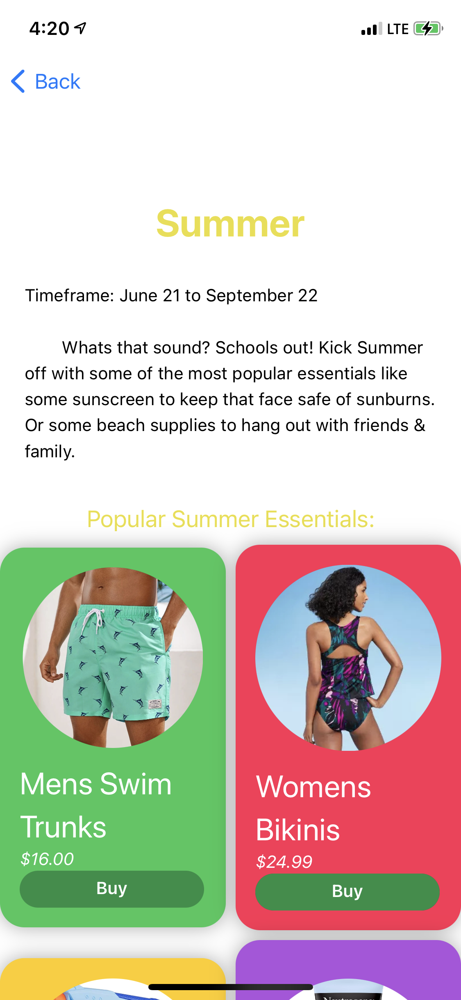
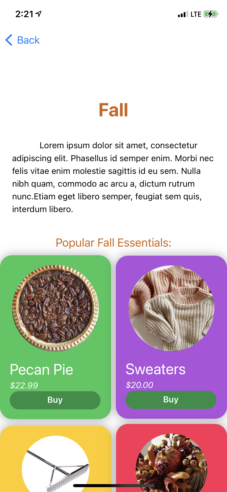
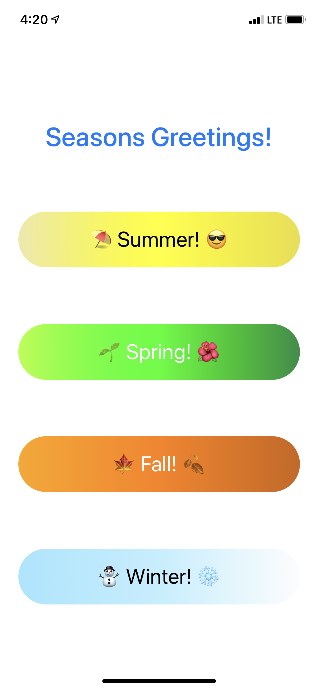

# Hackathon-March

**ContentView.swift** 
> Main page of the app when first opened.

**SummerView.swift**
> Summer page of the app with all its contents.

**SpringView.swift**
> Spring page of the app with all its contents.

**FallView.swift**
> Fall page of the app with all its contents.

**WinterView.swift**
> Winter page of the app with all its contents.

**Launch Screen.storyboard**
> The launch screen of the app. 

**Assets.xcassets**
> Folder containing all the assests such as images, and color sets.
   >* Colors: All the color sets
   >* Fall_Images: Images for the fall page
   >* Spring_Images: Images for the spring page
   >* Summer_Images: Images for the summer page
   >* Winter_Images: Images for the winter page.
  
  
  
**More Files**

_______________________
_______________________

_______________________
_______________________

__________________________________________________________________________________________________
*Files ending in .swift are the files that contain all the code that actually shows up in the app* 
